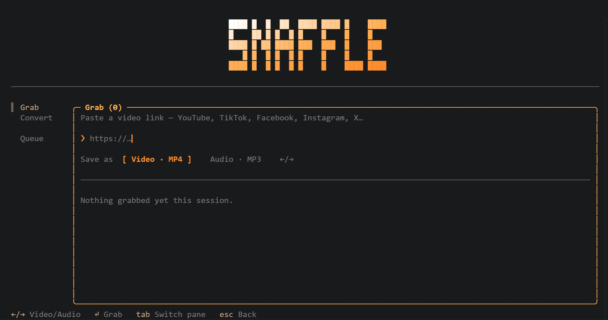

<p align="center">
  
</p>

<h1 align="center">snaffle</h1>

<p align="center">Grab any video and convert anything — right from your terminal. Zero setup, and your files never leave your disk.</p>

---

Grabbing a video off the web usually means a sketchy site full of fake buttons,
watermarks and size limits — and uploading your private file to a stranger's
server. Converting one is the same story. snaffle does both in your terminal
instead: paste a link and it grabs the video, browse to a file and it converts
it. **Everything happens on your machine; nothing is uploaded anywhere.**

## Get started

1. **Install Node** (from [nodejs.org](https://nodejs.org)).
2. **Run it:**

   ```sh
   npx snaffle
   ```

That's it. The yt-dlp and ffmpeg binaries snaffle needs are fetched
automatically the first time, so there's nothing to install by hand. Finished
files land in your `Downloads/snaffle` folder.

## What it does

**Grab — paste a link**
Works with YouTube, TikTok, Facebook, Instagram, X, and 1000+ more (anything
[yt-dlp](https://github.com/yt-dlp/yt-dlp) supports). Pick your output right on
the screen:

- **Video · MP4** — best video + audio, merged, with a quality picker (Best / 1080p / 720p / 480p)
- **Audio · MP3** — just the sound, extracted to MP3

**Convert — browse to a file**
No typing paths: a built-in file browser lets you arrow to any file (and switch
drives on Windows). It only shows the media you can actually convert, then offers
the formats that make sense:

| Input | Convert to |
| --- | --- |
| Video | MP4 · smaller/compressed MP4 · MP3 · M4A · **Trim** |
| Audio | MP3 · M4A · WAV · **Trim** |

**Trim** cuts a section out of any clip — pick the file, choose *Trim*, and type a
start and end time (e.g. `0:05 1:30`). Fast and lossless (it keeps the original
format).

**PDF — quick tools, all offline**
Three keyboard-driven tools (powered by pure-JS [pdf-lib](https://github.com/Hopding/pdf-lib), no extra binaries):

- **Images → PDF** — multi-select JPG/PNG (numbered in the order you pick them) into one PDF
- **Merge PDFs** — combine several PDFs into one
- **Split / extract** — pull pages out of a PDF with a simple spec like `1-3,5`

**Queue**
Downloads, conversions and PDF jobs run together with live progress, speed and
ETA, newest first.

## Keys

`tab` switch pane · `↑↓` move · `↵` open / pick · `←` up a folder · `esc` back ·
`q` quit. The bar at the bottom always shows what's available where you are.

## Roadmap

- PDF: compress, reorder/rotate pages
- Pause / resume / cancel in the queue
- Subtitles / thumbnail options on download

## A note on usage

snaffle is a thin, friendly front-end over the open-source yt-dlp and ffmpeg.
Downloading from a platform may be subject to its terms of service and to
copyright. Use it for content you have the right to save — your own uploads,
Creative Commons and public-domain works, or media you're allowed to keep for
offline viewing. Respecting those rules is on you.

## License

MIT
